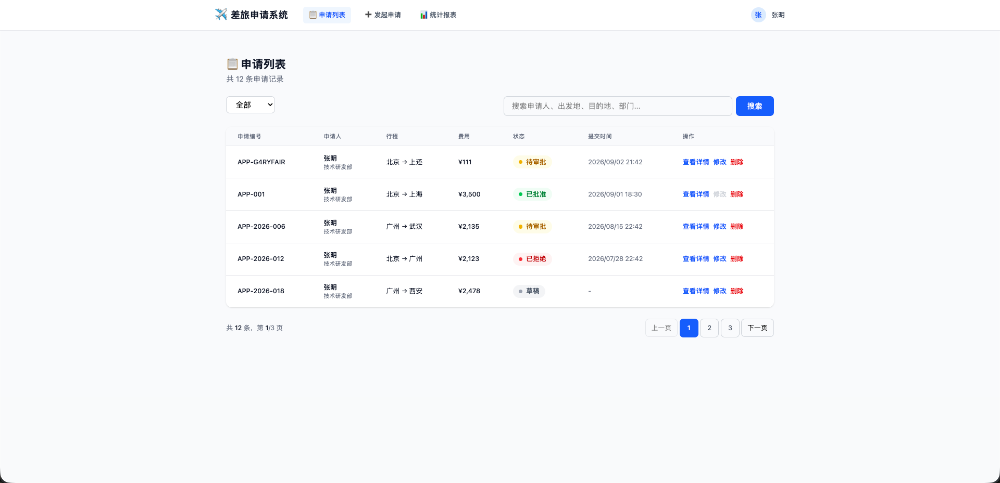
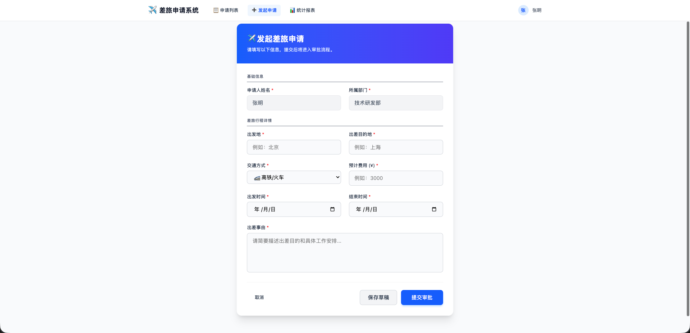
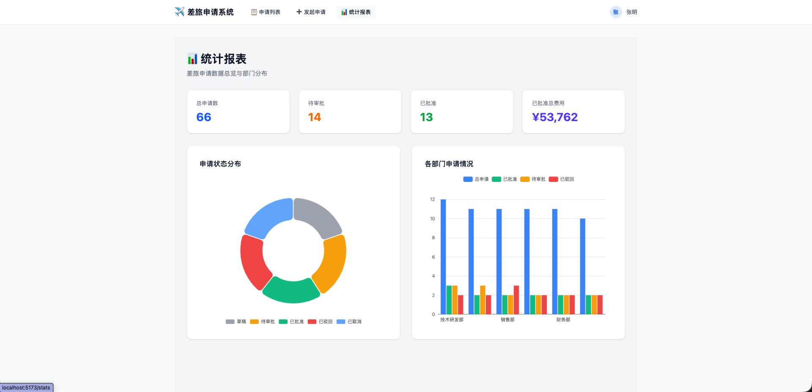
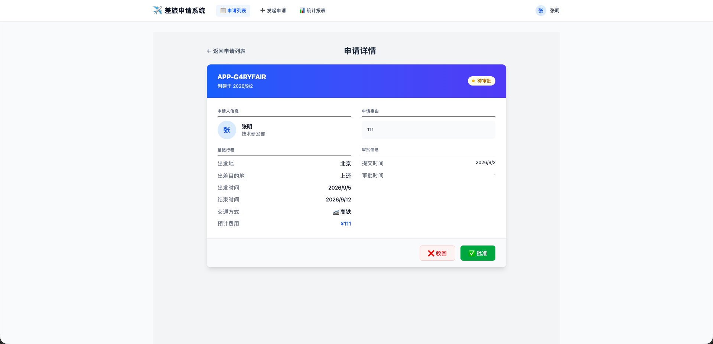

# ✈️ 差旅申请管理系统

基于 **SvelteKit + Svelte 5 (Runes) + Tailwind CSS v4 + ECharts** 的前端演示项目。

---

## 🚀 启动方式

```bash
# 1. 安装依赖
pnpm install

# 2. 启动开发服务器
pnpm dev
```

## 📍 路由说明


| 路径                  | 页面名称  | 功能说明                            |
| ------------------- | ----- | ------------------------------- |
| `/`                 | 申请列表页 | 支持状态筛选、关键字搜索、分页、修改、删除。          |
| `/create`           | 发起申请页 | 填写表单，支持“保存草稿”和“提交审批”。           |
| `/create?edit={id}` | 修改申请页 | 新增和修改共用同一页面，根据 URL 参数自动带出并修改数据。 |
| `/detail/{id}`      | 申请详情页 | 展示完整申请信息，支持“批准”和“驳回”操作。         |
| `/stats`            | 统计报表页 | 基于 ECharts 展示状态分布饼图和部门柱状图。      |


## 🔄 当前系统状态流转图

```text
【开始】 → 点击“发起申请”
              │
              ├──点击【保存草稿】──▶ 📝 草稿 (Draft)
              │                          │
              │                          ├──点击【编辑】──▶ 重新进入修改页
              │                          │
              │                          ├──点击【提交审批】──▶ ⏳ 待审批 (Pending)
              │                          │
              │                          └──点击【删除】──▶ 🚫 已取消 (Cancelled)
              │
              └──点击【提交审批】────────▶ ⏳ 待审批 (Pending)


⏳ 待审批 (Pending)
    │
    ├── 审批人点击【批准】──────────▶ ✅ 已批准 (Approved) （流程结束）
    │
    ├── 审批人点击【驳回】──────────▶ ❌ 已拒绝 (Rejected) （流程结束）
    │
    └── 申请人点击【删除】──────────▶ 🚫 已取消 (Cancelled) （流程结束）

```
### 1、申请列表Tab



| 操作 | 说明 |
| :--- | :--- |
| **状态筛选** | 通过下拉框选择“草稿”、“待审批”、“已批准”、“已拒绝”、“已取消”等状态。 |
| **关键字搜索** | 支持按“申请人姓名”、“目的地”、“所属部门”进行模糊搜索。 |
| **分页浏览** | 支持上一页/下一页及页码跳转，每页默认展示 5 条记录。 |
| **查看详情** | 点击“查看详情”，跳转至 `/detail/{id}` 页面。 |
| **修改** | 点击“修改”，跳转至 `/create?edit={id}` 页面；**已批准状态的申请禁止修改**。 |
| **删除** | 点击“删除”，确认后状态变为“已取消”，不可恢复。 |


### 2、发起申请Tab

1. **用户识别**：系统从 `localStorage` 读取当前用户信息（姓名、部门），自动填充到申请表单，并永久锁定不可修改。

2. **新增/修改**：访问 `/create` 为新增；访问 `/create?edit=id` 为修改，系统自动回显原有数据。

3. **提交方式**：表单支持两种提交动作：
   - 【保存草稿】：状态设为 `draft`。
   - 【提交审批】：状态设为 `pending`。

4. **数据操作**：
   - 新增：调用 `create` 方法生成新 ID，创建一条新记录。
   - 修改：调用 `update` 方法更新原记录，防止重复新增。

5. **流程闭环**：提交成功后自动跳转回列表页 `/`，展示最新状态。

### 3、统计报表Tab

1. **顶部统计卡片**
   - 总申请数、待审批数、已批准数、已批准总费用。

2. **申请状态分布（饼图）**
   - 基于 ECharts 绘制，展示各状态（草稿、待审批、已批准、已拒绝、已取消）的占比，鼠标悬停可查看具体数量。

3. **各部门申请情况（柱状图）**
   - 基于 ECharts 绘制，对比各部门的总申请、已批准、待审批、已驳回数量，直观呈现部门业务活跃度。

### 4、查看详情


## ⚠️ 未完成功能说明

### 1. 数据隔离与权限控制

**当前状态**：系统暂未实现用户身份权限区分，所有登录用户均可见全部数据。

**待实现功能**：

- **管理员角色（Admin）**：
  - 拥有系统全部权限。
  - 可查看和管理所有员工的申请列表。
  - 可对任何状态的申请进行审批、驳回等操作。
  - 可查看全量统计报表。

- **普通用户角色（User）**：
  - 权限受限，仅能查看**自己发起的申请列表**（数据隔离）。
  - 无法查看他人的申请信息。
  - 仅能访问“申请列表”和“发起申请”Tab。
  - 不可访问“统计报表”Tab（或仅能查看与自己相关的统计）。


---

### 2. 报销发票文件上传

**当前状态**：未实现文件上传功能。

**待实现功能**：

- 在“发起申请”表单中，新增【上传发票/收据】功能。
- 支持上传图片（`png`, `jpg`, `jpeg`）和 PDF 文件。
- 文件大小限制（例如：单文件不超过 5MB）。
- 上传后支持**本地即时预览**（图片预览或 PDF 文件名展示）。
- 支持上传多个附件，并进行删除/替换操作。
- 附件需与具体的申请单绑定（关联 `applicationId`）。